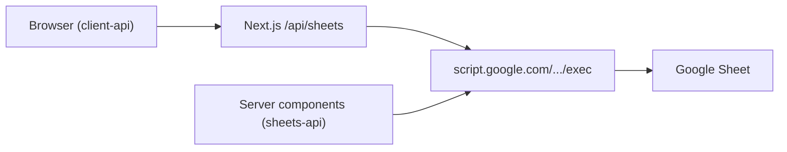

# EquityIQ — Apps Script Web App auth & API wiring

This document explains how the **Google Apps Script `/exec` Web App** connects to the **Next.js frontend** — not end-user login (there is no Clerk/Auth0 on EquityIQ today).

## What you have today

| Layer | Auth model |
|-------|------------|
| **Apps Script Web App** | Deployed as **Execute as: Me** + **Who has access: Anyone** (`ANYONE_ANONYMOUS` in `appsscript.json`). Callers do not sign in; Google runs the script as the **deploying Google account** and that account’s OAuth scopes (Sheets, external requests, etc.). |
| **Apps Script Execution API** | `MYSELF` only — used by **clasp** / `script.googleapis.com`, not by the browser. |
| **EquityIQ frontend** | Public research UI. No `middleware.ts`, no Clerk. “Auth” in settings means **which exec URL to call**, not user identity. |

The live exec URL (example):

`https://script.google.com/macros/s/AKfycbyNpQDZMj0vuWjWPH7dBs0hmn0pDBOB8uwUQLQmUPNEg4SaRpzP/exec` (latest UI deploy; verify `?action=health` returns JSON)

Anyone who knows this URL can call `?action=health`, `?action=top10`, etc. **Security is obscurity + rate limits**, not per-user OAuth. To restrict access you must change Web App deployment (e.g. domain / Google Workspace) or add your own gate (API key in script, Vercel protection, etc.).

## Who can call `/exec`?

Configured in `backend/automation/appsscript.json`:

```json
"webapp": {
  "access": "ANYONE_ANONYMOUS",
  "executeAs": "USER_DEPLOYING"
}
```

- **Browser / curl / Vercel server** → GET/POST to `script.google.com/.../exec?action=...` with no Google login.
- **CORS**: Google Web Apps generally allow browser `fetch` from other origins for GET JSON responses; failures are usually mis-deployed handlers or timeouts, not “login required”.
- **googleapis** (`script.googleapis.com`) → **clasp push**, project metadata, **not** the path the EquityIQ UI uses for research data.

## Environment variables

| Variable | Where | Purpose |
|----------|--------|---------|
| `SHEETS_API_URL` | **Server only** (Vercel, no `NEXT_PUBLIC_`) | Preferred production: full `/exec` URL. Never shipped to the browser bundle. |
| `NEXT_PUBLIC_SHEETS_API_URL` | Build-time public | Legacy: still works for **SSR** (`sheets-api.ts`) and is embedded in client JS if set. Prefer migrating to `SHEETS_API_URL` + proxy. |
| Settings `isi_sheets_api_url` | `localStorage` + cookie | Per-browser override; client may call **exec directly** when saved. |

Resolution order on the **server** (`getConfiguredSheetsApiUrl` / `getServerApiUrl`):

1. Explicit `baseUrl` argument  
2. `SHEETS_API_URL`  
3. `NEXT_PUBLIC_SHEETS_API_URL`  
4. Cookie `isi_sheets_api_url` (from Settings)

## Recommended production pattern

1. Deploy Web App (new version after `clasp push` / editor deploy).  
2. On Vercel **Production**:
   - Set `SHEETS_API_URL` = your `/exec` URL (encrypted).  
   - **Remove** `NEXT_PUBLIC_SHEETS_API_URL` when possible so the exec URL does not appear in client JavaScript.  
3. Client components use **`/api/sheets?action=...`** (same-origin proxy in `frontend/src/app/api/sheets/route.ts`), which forwards to `SHEETS_API_URL` on the server.  
4. Server Components / SSR keep using `frontend/src/lib/sheets-api.ts` (direct server-side `fetch` to exec — URL never sent to the browser).



## googleapis vs script.google.com

| URL / tool | Role |
|------------|------|
| `https://script.google.com/macros/s/.../exec` | **Web App** — EquityIQ data API (`?action=health`, `top10`, `symbol`, …). |
| `https://script.googleapis.com/v1/projects/{scriptId}/content` | **clasp** upload (`scripts/clasp_push_indian_equity.sh`). Requires **Apps Script API** enabled in Google account settings. |
| `https://script.google.com/home/usersettings` | Enable Apps Script API for clasp. |
| OAuth scopes in `appsscript.json` | Used when the **deployer’s** script runs (Spreadsheet read/write, `UrlFetch`, triggers). |

Browser errors mentioning **googleapis** during normal browsing usually mean a misconfigured client calling the wrong host, or a dev tool — not the intended EquityIQ path.

## Settings page behavior

- **Demo mode** → local demo payloads; no exec calls.  
- **API URL field** → optional; saves to `localStorage` + cookie. When set, **client** fetches go **directly** to that exec URL (bypasses proxy). Leave empty on production to use `/api/sheets` + server env.  
- **SSR** reads demo cookie `isi_demo_mode` and env/cookie URL via `hasServerSheetsApi()`.

## Do you need Clerk?

**No** for the current product: public research terminal backed by an already-public Web App. Add Clerk (or similar) only if you need **accounts**, private portfolios per user, or to hide the app behind login. That does **not** replace securing the Apps Script URL if the Web App stays `ANYONE_ANONYMOUS`.

## Operator checklist

1. Confirm Web App deployment: **Execute as me**, access per your risk tolerance.  
2. `curl -sSL "$EXEC_URL?action=health"` → JSON with `"ok": true` (or expected shape).  
3. Vercel: `SHEETS_API_URL` set; redeploy.  
4. Production site: Network tab shows `equityiq-*.vercel.app/api/sheets?action=...` for client widgets, not `script.google.com` (unless Settings override).  
5. Optional: `python scripts/verify_live_api.py` with `API_URL` or `SHEETS_API_URL`.

## Related files

- `frontend/src/app/api/sheets/route.ts` — proxy + action allowlist  
- `frontend/src/lib/sheets-api.ts` — server fetch  
- `frontend/src/lib/client-api.ts` — browser fetch (proxy or Settings URL)  
- `frontend/src/lib/api-url.ts` — env resolution  
- `backend/automation/WebAppApi.gs` — `doGet` actions  
- `backend/automation/appsscript.json` — Web App access mode  
