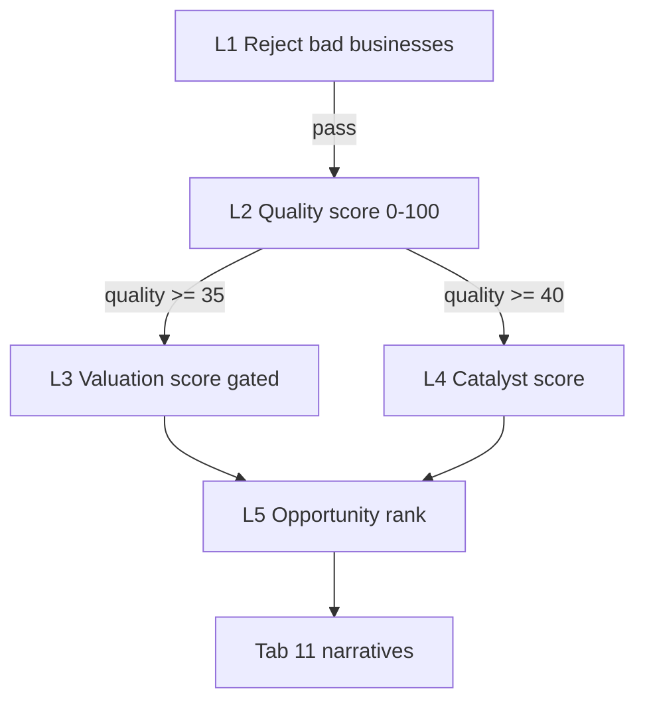

# Conviction Engine 3.1 — Tiered Investment Framework

**Version:** 3.1  
**Apps Script:** `backend/automation/ConvictionEngine3.gs`  
**Full methodology:** [`CONVICTION_METHODOLOGY.md`](CONVICTION_METHODOLOGY.md)  
**Tab 10:** pillars C–K = inputs; **conviction_total (M)** = **opportunity_rank** (no SUM formula on M).

Five stages: reject → quality → undervalued quality → catalysts → rank. Outputs: `quality_score`, `valuation_score`, `catalyst_score`, `alpha_score`, `opportunity_rank`.

---

## Hierarchy

| Level | Purpose | Output |
|-------|---------|--------|
| **1** | Reject untradeable / bad businesses | `REJECTED` — pledge, pump, SEBI, weak core, high debt |
| **2** | Find quality businesses | `quality_score` 0–100 |
| **3** | Undervalued **among** quality | `valuation_score` 0–100 (requires quality ≥ 50) |
| **4** | Near-term catalysts | `catalyst_score` 0–100 (requires quality ≥ 40) |
| **5** | Rank opportunities | `opportunity_rank` 0–100 → **conviction_total** |

**Stages on Tab 10:** `conviction_stage` = `REJECTED` | `QUALITY` | `VALUATION` | `CATALYST` | `RANKED`

---

## Scores (not additive)

| Score | Column | Formula idea |
|-------|--------|----------------|
| **quality_score** | 46 | Weighted fundamentals + moat + sector + DQ; ROCE/ROE bonuses from Tab 6 |
| **valuation_score** | 47 | Valuation + growth pillars × (quality/100); undervaluation tags |
| **catalyst_score** | 48 | News, filings, orders, promoter, tech, institutional flow |
| **alpha_score** | 44 | √(quality×valuation) + catalyst timing + momentum/flow — **not** legacy weighted factors |
| **opportunity_rank** | 50, **M** | Geometric blend **72%** + bottleneck **28%**; stage dampeners (see methodology) |

**M ≠ sum(C–K).** `additive_pillar_sum` is narrative-only. Column M has **no** `=SUM(C:J)` formula when Engine 3.1 is enabled (`applyConvictionFormulas_` skipped).

---

## Tab 11 recommendation copy

Each pick includes three institutional questions (in `bull` / API `decision`):

| Question | Field |
|----------|--------|
| **Why now?** | `why_now` — catalysts, filings, promoter, horizons |
| **Why this stock?** | `why_stock` — quality thesis, moat, ROCE, valuation score |
| **Why better than peers?** | `why_peers` — vs sector median core quality / Tab 19 rank |

Built by `buildInstitutionalRecommendationNarrative_()` → `buildEngine3Narratives_()`.

---

## Pipeline integration

1. `populateQuantitativeScores_` / `applyAutoSubScoresAndRefreshTotals_` — pillars + helpers  
2. `applyScoringDataMetrics_` — DQ, gates  
3. **`applyConvictionEngine3Batch_`** — writes Q/V/C/stage/M/α  
4. `generateRecommendations_` — sorts by `recommendationSortKey_` (Engine 3 aware)

**Menu:** Stock Tracker → **Preview Conviction Engine 3.0**

**Disable Engine 3:** set `USE_CONVICTION_ENGINE_3_ = false` in `ConvictionEngine3.gs` (reverts to additive M + legacy alpha batch).

---

## Tab 11 gates (updated)

- `ENGINE3_REJECTED` — stage REJECTED  
- `LOW_QUALITY_SCORE` — quality &lt; 35  
- `LOW_OPPORTUNITY_RANK` — rank &lt; 20 (replaces raw additive conviction)

---

## Related docs

- [`PEER_COMPARISON_ENGINE.md`](PEER_COMPARISON_ENGINE.md) — sector median PE/PB/ROCE/growth + relative Q/V/S scores  
- [`ALPHA_ENGINE.md`](ALPHA_ENGINE.md) — alpha classification bands (used after hierarchical alpha)  
- [`RECOMMENDATION_ENGINE_REVIEW.md`](RECOMMENDATION_ENGINE_REVIEW.md)  
- [`DATA_QUALITY_ENGINE.md`](DATA_QUALITY_ENGINE.md)

---

## Deploy

1. Paste **`ConvictionEngine3.gs`** into Apps Script with other modules.  
2. **Setup all sheet tabs** (adds five Tab 10 columns).  
3. **Rebuild scoring pipeline** → **Sync recommendations**.  
4. API/Web App: `decision.why_now`, `why_stock`, `why_peers` on `?action=top10` and symbol payloads.
