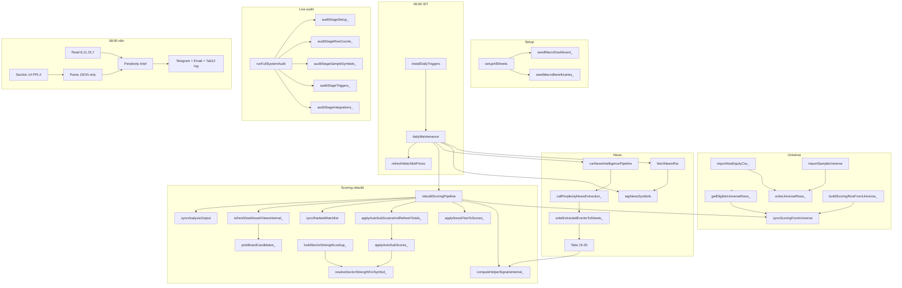

# E2E Live Functionality Audit

**Date:** 2026-06-03  
**Evidence:** **CODE-VERIFIED** = static trace in `backend/automation/Code.gs`, `runSystemAudit.gs`, `backend/workflows/workflow-indian-equity-morning.json`. **RUNTIME** = run **Stock Tracker → Run full system audit** in your sheet (writes `AUDIT SNAPSHOT`, property `LAST_SYSTEM_AUDIT_JSON`, Executions log).

The agent cannot open your Google Sheet. Live row counts and symbol checks come only from `runFullSystemAudit()`.

---

## 1. Executive summary

| Question | Verdict | Basis |
|----------|---------|-------|
| Will **actionable** research-grade Top 10 exist at 8 AM IST tomorrow? | **NO** | Tab 10 C–L mostly auto-only; E,G,H,I,L never filled by code; conviction ties at ~0 → arbitrary pipeline board |
| Will **mechanical** Top 10 rows exist (Tab 11 recommendation lists)? | **PARTIAL** | Possible if `installDailyTriggers` + 06:00 `dailyMaintenance` succeed and UNIVERSE → rebuild runs. **11b deprecated.** |
| Can you **prove** state in 5 minutes? | **YES** | Menu audit + `LAST_SYSTEM_AUDIT_JSON` |

**Top blockers:** (1) Runtime triggers + `PERPLEXITY_API_KEY` + 06:00 chain. (2) Sparse Tabs 15–20 per symbol → helpers N–R = 0 → C,D,F stay 0. (3) UNIVERSE `sector` empty after NSE CSV → Tab 19 join fails. (4) n8n credentials still `CONFIGURE_*` placeholders — delivery only, no sheet writes to 10/11/15–20. (5) n8n morning brief reads Tabs 8,11,15,7 only; Section 14 JSON is context-only, not written to sheets.

---

## 2. Pass / partial / fail — 16 subsystems

| # | Subsystem | CODE | RUNTIME (menu audit) |
|---|-----------|------|----------------------|
| 1 | Tab bootstrap (21 + 11b) | **PASS** `setupAllSheets` | Stage **A**: missing tabs / header mismatch |
| 2 | UNIVERSE import | **PARTIAL** NSE 403 risk | **B**: `1. UNIVERSE` dataRows |
| 3 | Eligibility → Tab 10 | **PASS** | **B**: `10. SCORING MODEL` dataRows > 0 |
| 4 | RSS → Tab 7 | **PARTIAL** silent if Tab 13 empty | **B**: `7. NEWS FLOW` dataRows |
| 5 | News tag symbols | **PARTIAL** silent empty | (no dedicated row; infer from Tab 7 col K) |
| 6 | Perplexity extract | **PASS** path | **E**: `perplexityApiKeySet`; optional `LAST_NEWS_PIPELINE_SUMMARY` |
| 7 | Write events 15–20 | **PARTIAL** filter/dedup | **B**: row counts 15–20 |
| 8 | Helpers N–R | **PARTIAL** zeros if tabs empty | **C**: `helpersN_R` per sample symbol |
| 9 | News hints C,D,F | **PARTIAL** weak RSS materiality | **C**: `colsC_M` |
| 10 | Auto sub-scores C,D,F,J,K | **PARTIAL** E,G,H,I,L skipped | **C**: cols C–M |
| 11 | Conviction M | **PASS** formula + script; stale M reconciled on rebuild | **C** + **F**: `m_recomputed`, `m_stale`, effective M |
| 12 | Tab 11 watchlist | **PASS** if Tab 10; **Fix Tab 11 headers** migrates row 1 | **A** header mismatch + **B** row count |
| 13 | Tab 11b boards | **PARTIAL** filters empty boards | **E**: `pickBoardCandidates` per board |
| 14 | Tab 21 stubs | **PARTIAL** not Section 4 cards | **B**: `21. ANALYSIS_OUTPUT` |
| 15 | Prices Tab 2 | **PARTIAL** no score feed to I | **B**: optional (not in audit list) |
| 16 | n8n 08:00 delivery | **FAIL** until creds; no sheet write | User n8n execution log |

**Overall automation readiness (code):** ~45%. **Actionable Top 10 readiness:** ~25%.

---

## 3. Tab-by-tab (21 + 11b)

| Tab | CODE-VERIFIED source | Expected downstream | RUNTIME |
|-----|----------------------|---------------------|---------|
| 1 UNIVERSE | NSE CSV / sample | Tab 10 eligibility, sector join | Audit **B** + **C** `inUniverse` |
| 2 PRICE | `refreshWatchlistPrices` | Display only (not I on Tab 10) | Manual |
| 3 ANNOUNCEMENTS | Manual | Keywords → Tab 12 only | Manual |
| 4 BULK | None | — | Empty |
| 5 INSIDER | None | — | Empty |
| 6 FUNDAMENTALS | None | E,G,H manual | Empty → moat boards fail |
| 7 NEWS FLOW | `fetchNewsRss` | Perplexity, `applyNewsFlowToScores_` | **B** row count |
| 8 MACRO | `seedMacroDashboard_` | n8n read | **B** (not listed; check sheet) |
| 9 GEOPOLITICS | Perplexity append | Display | **B** |
| 10 SCORING | `syncScoringFromUniverse` + rebuild | 11, 11b, 21 | **B** + **C** |
| 11 WATCHLIST | `syncRankedWatchlist` | n8n, prices | **B** |
| 11b BOARDS | `refreshDashboardViewsInternal_` | UI | **B** + **E** board counts |
| 12 ALERTS | `appendAlert` | Audit trail | **B** |
| 13 NEWS SOURCES | `syncNewsSourcesToSheet` | RSS gate | Run sync if RSS silent |
| 14 INDIA IMPACT | Perplexity append | Research | **B** |
| 15 FILINGS | Perplexity append | Helper N, D auto | **B** |
| 16 ORDER BOOK | Perplexity append | O → C via `O*5` | **B** |
| 17 ANALYST | Perplexity append | Q | **B** |
| 18 PROMOTER | Perplexity append | P | **B** |
| 19 SECTOR | Perplexity **replace** | R, F auto | **B** + **C** `sectorMatchTab19` |
| 20 MACRO BEN | Perplexity **replace** | F via tokens | **B** |
| 21 ANALYSIS | `syncAnalysisOutput` stubs | Not full cards | **B** |

---

## 4. Function dependency map

**Dead / duplicate (CODE):** `buildSectorRankMap_`, `lookupSectorRank_` — no production callers. `computeHelperSignals` — alias only. Audit **E** lists these.

---

## 5. Root causes (ranked)

| Rank | Root cause | Symptom |
|------|------------|---------|
| 1 | 08:00 path does not refresh Tab 10/11 from n8n | Stale or zero conviction at delivery time |
| 2 | Event tabs sparse per symbol | N,O = 0 → C,D ≈ 0 |
| 3 | UNIVERSE `sector` blank (NSE CSV) | `resolveSectorStrengthForSymbol_` null → R,F = 0 |
| 4 | Tab 6 never auto-filled | E,G,H = 0; moat boards empty |
| 5 | `applyAutoSubScores_` skips E,G,H,I,L | Even with helpers, half the model manual |
| 6 | n8n `CONFIGURE_*` placeholders | No Telegram/email |
| 7 | `pickBoardCandidates_` downgrades filter inverted | “Watchlist Downgrades” board wrong |
| 8 | Conviction ties at 0 | Pipeline Top 10 lexicographic, not actionable |

---

## 6. Exact fix list (ranked)

| Priority | Action | Owner |
|----------|--------|-------|
| P0 | **Stock Tracker → Install daily triggers**; confirm Executions ~06:00 IST | User |
| P0 | Set `PERPLEXITY_API_KEY`; run **Rebuild scoring pipeline** after **Run news intelligence pipeline** | User |
| P0 | **Run full system audit**; archive `LAST_SYSTEM_AUDIT_JSON` | User |
| P1 | Merge Screener `sector` + `market_cap_cr` on Tab 1; rerun rebuild | User |
| P1 | Paste Tab 6 fundamentals for watchlist OR Section 4 prompts | User |
| P1 | Configure n8n: `SHEET_ID`, Google OAuth, Perplexity, Telegram, SMTP | User |
| P2 | Fix `downgradesOnly` in `pickBoardCandidates_` L2752 | Code |
| P2 | Extend n8n reads to Tabs 16,19,20 OR rely on 06:00 Apps Script only | Code/n8n |
| P3 | Remove dead `buildSectorRankMap_` / `lookupSectorRank_` | Code |
| P3 | Add `DEFENCE` / `AEROSPACE` to `normalizeSectorKey_` aliases | Code |

---

## 7. YES / NO — tomorrow 8 AM Top 10

| Deliverable | Tomorrow 8 AM? |
|-------------|----------------|
| **Actionable** Top 10 (M≥50, multi-driver, confirmed filing) | **NO** |
| **Mechanical** Top 10 rows in Tab 11 / 11b pipeline board | **PARTIAL** — only if triggers + rebuild succeeded before 08:00 |
| **Telegram/email** structured Top 10 JSON | **NO** — `Parse Report` sends 3500-char excerpt (`workflow` L234) |
| **Proof of system health** | **YES** — run menu audit now and after 06:00 run |

---

## Hard evidence — RELIANCE, TCS, BEL, HAL

**How values should populate (CODE path).** Runtime columns filled by `runFullSystemAudit()` stage **C**.

| Step | Mechanism | RELIANCE | TCS | BEL / HAL |
|------|-----------|----------|-----|-----------|
| Tab 1 row | Sample / NSE import | Sample: sector `Energy` | Sample: `IT Services` | NSE CSV: **sector often empty** L422–427 |
| Tab 10 row | `buildScoringRowFromUniverse_` | New row C–L = 0 L1052–1054 | Same | Same if eligible |
| N (filings 30d) | `countEventsSince_(Tab15)` L1492 | Needs RELIANCE rows on 15 | Needs TCS rows | Needs symbol rows |
| O (orders 90d) | `countEventsSince_(Tab16)` L1493 | Per-symbol | Per-symbol | Often 0 globally if 1 row other symbol |
| R (sector rank) | Tab 19 + `normalizeSectorKey_` | `ENERGY` alias → Tab 19 `sector` match L1608 | `IT SERVICES` L1545–1547 | Empty sector → **join fail** L1628–1629 |
| C auto | `min(15, O*5)` L1183 | O>0 required | O>0 | O=0 → C=0 |
| F auto | `sectorMacroSuggestionFromStrength_` L1644–1654 | rank≤3 → 8 | Same if R>0 | R=0 → F=0 |
| E,G,H | — | **No auto** | **No auto** | **No auto** |
| M | `calculateConvictionFromRow_` L1145–1150 | Sum capped C–L | Same | Low unless events + sector |

**Audit output fields (per symbol):** `inUniverse`, `inScoringTab10`, `colsC_M`, `convictionAudit` (`m_sheet`, `m_recomputed`, `m_stale`), `helpersN_R`, `sectorMatchTab19`, `sectorJoinOk`. Stage **C_universeSector** counts blank Tab 1 `sector` (blocks Tab 19 join).

**Stale M (e.g. RELIANCE M=45, C–L=0):** Not a formula bug — `getValues()` reads stored M while components were cleared or never filled. Rebuild runs `reconcileConvictionColumn_` and reapplies column M formulas.

---

## n8n workflow — Sheets 15–20?

**CODE-VERIFIED** from `backend/workflows/workflow-indian-equity-morning.json`:

| Action | Nodes | Writes Sheets 15–20? |
|--------|-------|----------------------|
| Schedule 08:00 IST | `Weekdays 08:00 IST` | — |
| Read | Tabs **8, 11, 15, 7** only | No |
| Section 14 branch | `Perplexity News Extraction` → `Parse Events JSON` | **No** — JSON merged into `Build Perplexity Context` as text snippet |
| Morning brief | `Perplexity API` → `Parse Report` | **No** |
| Output | `Telegram Report`, `Email Report`, `Log to Alerts` | **Only Tab 12** append `perplexity_morning` |

**Conclusion:** n8n does **not** write Tabs 15–20. Apps Script `writeExtractedEventsToSheets_` owns event tabs. n8n is **read + Telegram/email + Tab 12 log**.

Sticky note on Perplexity News node: *"Prefer Apps Script write to Tabs 15-20"* (L173).

---

## Run live audit (~5 minutes)

1. Paste `Code.gs` + `runSystemAudit.gs` into Apps Script → Save → reload sheet.
2. **Stock Tracker → Setup all sheet tabs** (once).
3. Import UNIVERSE (sample or NSE) → **Rebuild scoring pipeline from UNIVERSE**.
4. Optional: set `PERPLEXITY_API_KEY`, fetch RSS, run news pipeline.
5. **Stock Tracker → Run full system audit**.
6. Review UI alert (PASS/PARTIAL/FAIL), tab **AUDIT SNAPSHOT**, Executions log, Script property **`LAST_SYSTEM_AUDIT_JSON`**.

**Pass (mechanical Top 10):** Stage B Tab 11 ≥ 10 rows; Stage E pipeline board `pickedCount` = 10; Stage D `hasDailyMaintenance` true.

**Pass (actionable Top 10):** Stage C shows ≥2 sample symbols with `M_conviction_total` ≥ 50 and multiple C,D,F,J,K ≥ 5 — unlikely without Tab 6 + events.

---

## Related docs

- Static deep dive: [FULL_FUNCTIONALITY_VERIFICATION_AUDIT.md](FULL_FUNCTIONALITY_VERIFICATION_AUDIT.md)
- Architecture: [FULL_SYSTEM_AUDIT.md](FULL_SYSTEM_AUDIT.md)
- Apps Script install: [../backend/automation/README.md](../backend/automation/README.md)

*Re-run audit after `Code.gs`, `runSystemAudit.gs`, or n8n workflow changes.*
