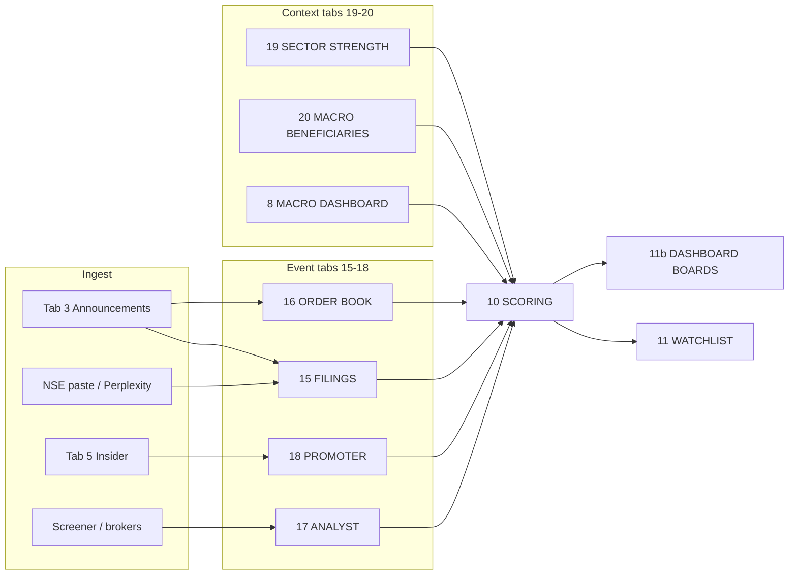

# Event-led intelligence architecture (v2)

v2 shifts conviction scoring from a news-heavy 8-component model to a **10-component, event-led** model centered on exchange filings, order wins, promoter behavior, analyst revisions, sector strength, and macro beneficiary mapping.

## Tab map (20 numbered + staging)

| Tab | Name | Role |
|-----|------|------|
| 1–7 | UNIVERSE … NEWS FLOW | Unchanged from v1 |
| 8 | MACRO DASHBOARD | Daily metrics (USDINR, FII/DII, verdict) |
| 9 | GEOPOLITICS FLAGS | Event → sector map |
| 10 | SCORING MODEL | 10-component conviction (100 pts) + helper signals |
| 11 | RANKED WATCHLIST | Sorted picks from Tab 10 |
| 11b | DASHBOARD BOARDS | Multi-bucket QUERY views (Top 10 lists) |
| 12–14 | ALERTS … INDIA IMPACT | Unchanged |
| 15 | FILINGS | Structured filing intelligence |
| 16 | ORDER BOOK TRACKER | Order wins / book build |
| 17 | ANALYST REVISIONS | Broker rating & target changes |
| 18 | PROMOTER ACTIVITY | PIT-style promoter / pledge detail |
| 19 | SECTOR STRENGTH | Weekly sector composite ranks |
| 20 | MACRO BENEFICIARIES | Metric → beneficiaries / losers map |
| 21 | ANALYSIS_OUTPUT | Perplexity Tables A–D staging (was unnumbered ANALYSIS_OUTPUT) |

**Naming note:** Tab **8** and Tab **20** both relate to macro. Tab 8 is operational daily dashboard; Tab 20 is **who wins/loses** from each macro move. See [docs/SHEET_SETUP.md](../docs/SHEET_SETUP.md).

## Data flow

## Scoring philosophy

1. **Filings over media** — Tab 15 + Tab 3 `confirmed_flag` drive `corporate_trigger` and `filings_intelligence` before Tab 7 news boosts.
2. **Helpers suggest, humans score** — Apps Script `computeScoringHelpers()` fills COUNTIFS helpers on Tab 10; sub-scores are still manual / Perplexity-assisted.
3. **Sector context** — Tab 19 `composite_rank` feeds `sector_strength_rank` helper; apply to `sector_macro` manually.
4. **No NSE session API** — v2 documents paste + Perplexity workflows; optional `parseAnnouncementKeywords()` suggests Tab 15/16 rows from Tab 3 headlines only.
5. **v3 automated path** — `runNewsIntelligencePipeline()` (Section 14) writes Tabs 15–20 from Tab 7 via Perplexity API; see [NEWS_TO_SCORING.md](NEWS_TO_SCORING.md).

## Apps Script surface (free tier)

| Function | Purpose |
|----------|---------|
| `setupAllSheets` | Creates tabs 1–21 + 11b |
| `openNseFilingsHelper` | URL template per symbol for manual filing pull |
| `computeScoringHelpers` | COUNTIFS → Tab 10 helper columns |
| `parseAnnouncementKeywords` | Keyword scan Tab 3 → suggest 15/16 rows |
| `refreshDashboardViews` | Rebuild 11b boards from Tab 10 + event tabs |

## Perplexity sections (v2)

| Section | File | Primary tabs |
|---------|------|--------------|
| 09 | `09-filing-interpretation.md` | 15 |
| 10 | `10-order-book.md` | 16 |
| 11 | `11-promoter.md` | 18 |
| 12 | `12-sector-strength.md` | 19, 20 |
| 13 | `13-dashboard-views.md` | 11b |

## v1 → v2 migration

1. Run **Stock Tracker → Setup all sheet tabs** (adds 15–21, 11b).
2. Rename legacy sheet `ANALYSIS_OUTPUT` → `21. ANALYSIS_OUTPUT` if present.
3. Update Tab 10 headers from `schemas/10-scoring-model.csv`; remap conviction formula (see [SCORING.md](../shared/scoring/SCORING.md)).
4. Re-paste Perplexity outputs to Tab 21 instead of unnumbered ANALYSIS_OUTPUT.

## Known limitations

- No authenticated NSE API scraping.
- Order book and analyst rows are manual / Perplexity unless you build a paid data feed later.
- Dashboard boards depend on populated Tab 10 scores and optional QUERY in Sheet (documented, not all auto-filled by script).
