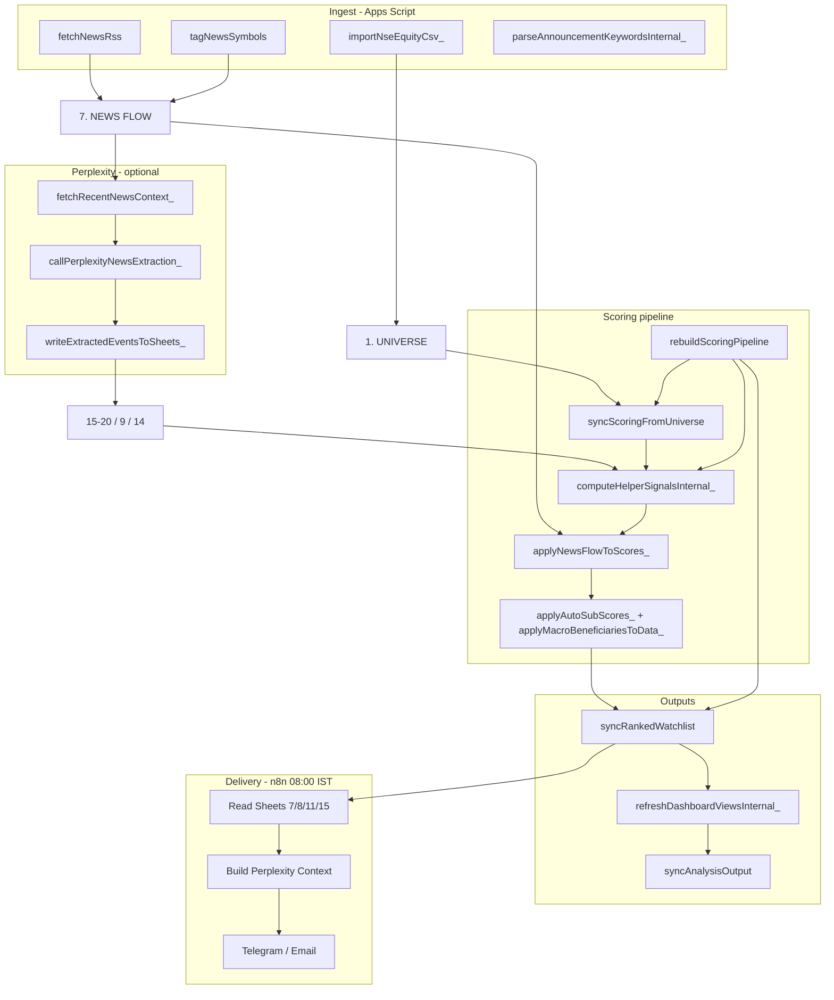
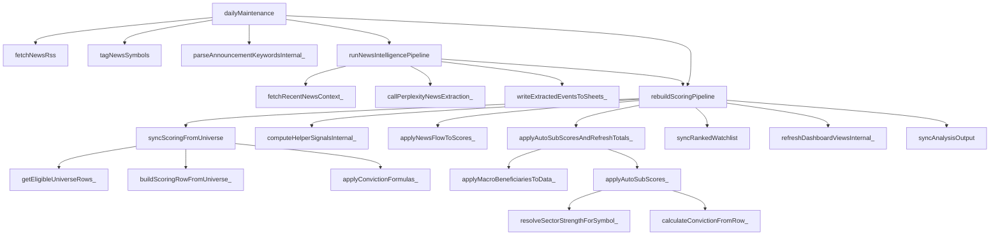

# Full System Audit — Indian Stock Intelligence Tracker

**Audit date:** 2026-06-03  
**Scope:** `/Users/anandbherwani/Documents/Stock automation` (repo only; live Google Sheet state not readable)  
**Primary code:** `backend/automation/Code.gs` (~2,780 lines, 74 functions)  
**Method:** Static trace of menu, triggers, and call graph; cross-check `backend/workflows/workflow-indian-equity-morning.json`, `docs/*`, `prompts/`, `config/`, schemas.

**Legend:** **WORKING** = implemented and callable from menu/triggers with expected behavior in code. **PARTIAL** = implemented but depends on manual data, user config, or external limits. **BROKEN** = known defect in code path. **NOT IMPLEMENTED** = documented aspiration only.

---

## PART 1 — Architecture

### End-to-end flow (mermaid)



### Pipeline steps — status table

| Step | Entry point | Writes to | Status | Notes |
|------|-------------|-----------|--------|-------|
| Sheet bootstrap | `setupAllSheets` (L242) | Tabs 1–21 + 11b headers | **WORKING** | Seeds Tab 8/20 if empty |
| NSE universe CSV | `importNseSymbolList` → `importNseEquityCsv_` (L311–357) | Tab 1 | **PARTIAL** | NSE may HTTP 403; no `market_cap_cr` until Screener merge |
| Cap classify | `classifyCapSegments` (L484) | Tab 1 cols G–H | **PARTIAL** | Needs `market_cap_cr` for real segments |
| RSS news | `fetchNewsRss` (L551) | Tab 7, 13 `last_fetch` | **PARTIAL** | Per-feed failures logged; max 200 items/run |
| Symbol tag on news | `tagNewsSymbols` (L699) | Tab 7 col K | **PARTIAL** | Naive name/symbol substring match |
| News → events (Perplexity) | `runNewsIntelligencePipeline` (L2547) | Tabs 15–20, 9, 14 | **PARTIAL** | Requires `PERPLEXITY_API_KEY`; drops non-universe symbols |
| Tab 10 from universe | `syncScoringFromUniverse` (L1081) | Tab 10 | **WORKING** | Preserves existing C–L per symbol |
| Helper columns N–R | `computeHelperSignalsInternal_` (L1460) | Tab 10 N–R | **PARTIAL** | Zero if event tabs empty |
| News hints on scores | `applyNewsFlowToScores_` (L2472) | Tab 10 C,D,F, AD–AE | **PARTIAL** | Hints only; 7d window |
| Auto sub-scores | `applyAutoSubScores_` (L1159) | Tab 10 C,D,F,J,K | **PARTIAL** | E,G,H,I,L not auto-filled |
| Full rebuild | `rebuildScoringPipeline` (L1361) | 10→11→11b→21 | **WORKING** | Orchestrates above |
| Watchlist prices | `refreshWatchlistPrices` (L736) | Tab 2 GOOGLEFINANCE | **PARTIAL** | Top 100 symbols; DMA/RSI cols empty |
| NSE filings URL | `openNseFilingsHelper` (L1409) | Alert only | **PARTIAL** | Manual browser paste to Tab 15 |
| Announcement keywords | `parseAnnouncementKeywords` (L2626) | Tab 12 suggestions | **PARTIAL** | Does not write Tab 15/16 rows |
| Daily automation | `dailyMaintenance` (L834) | Multi-tab | **PARTIAL** | Trigger not installed until user runs `installDailyTriggers` |
| n8n morning brief | Schedule 08:00 IST | Telegram, email, Tab 12 | **PARTIAL** | **Does not write** Tabs 15–20; raw Perplexity text |
| Cursor prompts 01–13 | Manual / MCP | Paste-back | **PARTIAL** | Not wired to Apps Script |
| Static dashboard HTML | `frontend/index.html` | None | **NOT IMPLEMENTED** | Mockup only |

---

## PART 2 — Sheet audit (21 tabs + 11b)

Row counts and fill quality: **VERIFY IN SHEET** for all tabs.

| Tab | Sheet name | Schema | Automation | Typical fill | Status |
|-----|------------|--------|------------|--------------|--------|
| 1 | `1. UNIVERSE` | `schemas/01-universe.csv` | NSE CSV, sample, manual Screener | Symbols yes; sector/mcap often empty after CSV-only import | **PARTIAL** |
| 2 | `2. PRICE & TECHNICALS` | `02-price-technicals.csv` | `refreshWatchlistPrices` | Price/chg/vol formulas only | **PARTIAL** |
| 3 | `3. NSE/BSE ANNOUNCEMENTS` | `03-announcements.csv` | Manual / Perplexity paste | Usually empty unless user pastes | **NOT IMPLEMENTED** (auto) |
| 4 | `4. BULK & LARGE DEALS` | `04-bulk-deals.csv` | Manual | Empty by default | **NOT IMPLEMENTED** |
| 5 | `5. INSIDER/PROMOTER` | `05-insider-promoter.csv` | Manual | Empty | **NOT IMPLEMENTED** |
| 6 | `6. FUNDAMENTALS` | `06-fundamentals.csv` | Screener CSV manual | Empty → moat/financial/valuation stay 0 | **NOT IMPLEMENTED** (auto) |
| 7 | `7. NEWS FLOW` | `07-news-flow.csv` | `fetchNewsRss`, `tagNewsSymbols` | Grows with RSS; symbol column often sparse | **PARTIAL** |
| 8 | `8. MACRO DASHBOARD` | `08-macro-dashboard.csv` | `seedMacroDashboard_`; USDINR formula | Mostly placeholders | **PARTIAL** |
| 9 | `9. GEOPOLITICS FLAGS` | `09-geopolitics-flags.csv` | Perplexity append via `writeExtractedEventsToSheets_` | Empty until pipeline runs | **PARTIAL** |
| 10 | `10. SCORING MODEL` | `10-scoring-model.csv` | `rebuildScoringPipeline` | Rows per eligible universe; C–L often low | **PARTIAL** |
| 11 | `11. RANKED WATCHLIST` | `11-ranked-watchlist.csv` | `syncRankedWatchlist` | Top 50 by conviction M | **WORKING** (if Tab 10 populated) |
| 11b | `11b DASHBOARD BOARDS` | `11-dashboard-views.csv` | `refreshDashboardViewsInternal_` | 12 boards × up to 10 rows; many boards empty due to filters | **PARTIAL** |
| 12 | `12. ALERTS LOG` | `12-alerts-log.csv` | `appendAlert` from many functions | Audit trail | **WORKING** |
| 13 | `13. NEWS SOURCES` | `13-news-sources.csv` | `syncNewsSourcesToSheet` | Mirrors `NEWS_SOURCES` in Code.gs | **WORKING** |
| 14 | `14. INDIA IMPACT LOG` | `14-india-impact-log.csv` | Perplexity append | Empty until pipeline | **PARTIAL** |
| 15 | `15. FILINGS` | `15-filings.csv` | Perplexity + manual paste | Empty without pipeline/paste | **PARTIAL** |
| 16 | `16. ORDER BOOK TRACKER` | `16-order-book-tracker.csv` | Perplexity + manual | Empty without events | **PARTIAL** |
| 17 | `17. ANALYST REVISIONS` | `17-analyst-revisions.csv` | Perplexity + manual | Empty without events | **PARTIAL** |
| 18 | `18. PROMOTER ACTIVITY` | `18-promoter-activity.csv` | Perplexity + manual | Empty without events | **PARTIAL** |
| 19 | `19. SECTOR STRENGTH` | `19-sector-strength.csv` | Perplexity **replaces** each run | Requires UNIVERSE `sector` join | **PARTIAL** |
| 20 | `20. MACRO BENEFICIARIES` | `20-macro-beneficiaries.csv` | Seed + Perplexity replace | Token match to symbols/sectors | **PARTIAL** |
| 21 | `21. ANALYSIS_OUTPUT` | `21-analysis-output.csv` | `syncAnalysisOutput` stubs | Auto-stub from Tab 11; not full Section 4 cards | **PARTIAL** |

**Tab 8 vs Tab 20:** Tab 8 = daily metric levels; Tab 20 = beneficiary/loser mapping (`applyMacroBeneficiariesToData_`, L1664). Do not conflate.

---

## PART 3 — Function audit

### Menu (`onOpen`, L205–237)

| Menu label | Handler |
|------------|---------|
| Setup all sheet tabs | `setupAllSheets` |
| Import full NSE universe (EQ) | `importNseSymbolList` |
| Import NSE SME / Emerge list | `importNseSmeSymbolList` |
| Classify cap segments | `classifyCapSegments` |
| Import sample universe (3 stocks) | `importSampleUniverse` |
| Sync news sources to Tab 13 | `syncNewsSourcesToSheet` |
| Fetch RSS news | `fetchNewsRss` |
| Tag news symbols | `tagNewsSymbols` |
| Run news intelligence pipeline (Perplexity) | `runNewsIntelligencePipeline` |
| View last news pipeline log | `viewLastNewsPipelineLog` |
| Rebuild scoring pipeline from UNIVERSE | `rebuildScoringPipeline` |
| Sync Tab 10 from UNIVERSE only | `syncScoringFromUniverse` |
| Refresh watchlist prices | `refreshWatchlistPrices` |
| Open NSE filings helper | `openNseFilingsHelper` |
| Compute scoring helpers | `computeScoringHelpers` |
| Sync ranked watchlist (Tab 11) | `syncRankedWatchlist` |
| Sync analysis output (Tab 21) | `syncAnalysisOutput` |
| Parse announcement keywords | `parseAnnouncementKeywords` |
| Refresh dashboard views | `refreshDashboardViews` |
| Log test alert | `logTestAlert` |
| Run daily maintenance now | `dailyMaintenance` |
| Install daily triggers (IST) | `installDailyTriggers` |

### Triggers (`installDailyTriggers`, L847–870)

| Trigger | Handler | Schedule (Asia/Kolkata) |
|---------|---------|-------------------------|
| Time-based | `dailyMaintenance` | 06:00 daily |
| Time-based | `fetchNewsRss` | 15:45 daily |

No `onEdit`, no web app `doPost`/`doGet` deployed in repo.

### All functions (74)

| Function | Line | Role |
|----------|------|------|
| `onOpen` | 205 | Menu |
| `setupAllSheets` | 242 | Create tabs |
| `seedMacroDashboard_` | 270 | Seed Tab 8 |
| `seedMacroBeneficiaries_` | 285 | Seed Tab 20 |
| `migrateLegacyAnalysisOutput_` | 301 | Rename legacy tab |
| `importNseSymbolList` | 311 | NSE EQ CSV |
| `importNseSmeSymbolList` | 315 | NSE SME CSV |
| `importNseEquityCsv_` | 323 | Fetch/parse CSV |
| `parseNseEquityCsv_` | 364 | CSV parser |
| `buildUniverseRow_` | 421 | Universe row template |
| `detectSme_` | 435 | SME detection |
| `writeUniverseRows_` | 448 | Write Tab 1 |
| `importSampleUniverse` | 466 | RELIANCE/TCS/INFY sample |
| `classifyCapSegments` | 484 | Cap buckets |
| `syncNewsSourcesToSheet` | 537 | Tab 13 |
| `fetchNewsRss` | 551 | Tab 7 RSS |
| `parseRssFeed_` | 617 | XML parse |
| `extractRssItem_` | 639 | RSS item |
| `extractAtomEntry_` | 654 | Atom item |
| `childText_` | 674 | XML helper |
| `childTextNs_` | 679 | XML NS helper |
| `loadExistingNewsUrls_` | 688 | Dedup URLs |
| `tagNewsSymbols` | 699 | Tag Tab 7 |
| `refreshWatchlistPrices` | 736 | Tab 2 prices |
| `collectWatchlistSymbols_` | 767 | Symbol list for prices |
| `appendAlert` | 801 | Tab 12 |
| `logTestAlert` | 811 | Test alert |
| `checkHighMaterialityNewsAlerts` | 816 | News → alerts |
| `dailyMaintenance` | 834 | Scheduled bundle |
| `installDailyTriggers` | 847 | Install triggers |
| `clearDataBelowHeader_` | 881 | Safe clear |
| `getOrCreateSheet_` | 890 | Sheet factory |
| `parseCsvLine_` | 908 | CSV line |
| `getEligibleUniverseRows_` | 933 | Eligibility filter |
| `universeRowToObject_` | 951 | Row → object |
| `isUniverseEligible_` | 972 | Rules |
| `universeHardFlags_` | 1009 | Tab 10 flags |
| `loadExistingScoringBySymbol_` | 1026 | Preserve scores |
| `buildScoringRowFromUniverse_` | 1046 | New Tab 10 row |
| `syncScoringFromUniverse` | 1081 | Tab 10 sync |
| `applyConvictionFormulas_` | 1119 | Column M formulas |
| `applyConvictionTotalsInScript_` | 1135 | M in script |
| `calculateConvictionFromRow_` | 1145 | Sum C–L capped |
| `applyAutoSubScores_` | 1159 | Helper → C,D,F,J,K |
| `getTopScoringSymbols_` | 1216 | Top N symbols |
| `syncRankedWatchlist` | 1233 | Tab 11 |
| `pickHorizonLabel_` | 1291 | Horizon string |
| `buildUniverseLookup_` | 1303 | Symbol map |
| `syncAnalysisOutput` | 1319 | Tab 21 stubs |
| `rebuildScoringPipeline` | 1361 | Main orchestrator |
| `applyAutoSubScoresAndRefreshTotals_` | 1387 | Macro + auto + write |
| `openNseFilingsHelper` | 1409 | NSE URL modal |
| `computeScoringHelpers` | 1435 | Helpers + downstream |
| `computeHelperSignals` | 1456 | **Alias** → `computeScoringHelpers` |
| `computeHelperSignalsInternal_` | 1460 | N–R counts |
| `loadSheetData_` | 1521 | Read tab data |
| `normalizeSymbolKey_` | 1533 | Upper trim |
| `normalizeSectorKey_` | 1541 | Sector aliases |
| `weekEndingKey_` | 1571 | Date key Tab 19 |
| `buildUniverseBySymbol_` | 1581 | Sector map |
| `buildSectorStrengthLookup_` | 1599 | Tab 19 latest week |
| `resolveSectorStrengthForSymbol_` | 1626 | Join sector |
| `sectorMacroSuggestionFromStrength_` | 1644 | F suggestion |
| `applyMacroBeneficiariesToData_` | 1664 | Tab 20 → F |
| `parseBeneficiaryTokens_` | 1705 | Token split |
| `countEventsSince_` | 1720 | Dated/undated count |
| `hasPromoterBuy_` | 1740 | Promoter buy flag |
| `parseSheetDate_` | 1758 | Date parse |
| `buildSectorRankMap_` | 1769 | **Dead** — no callers |
| `lookupSectorRank_` | 1784 | **Dead** — no callers |
| `coerceSectorStrengthLookup_` | 1796 | Used only by dead `lookupSectorRank_` |
| `getPerplexityApiKey_` | 1814 | Script property |
| `shouldRunPerplexityDaily_` | 1824 | Daily flag |
| `getNewsExtractionSystemPrompt_` | 1833 | System prompt |
| `buildNewsExtractionUserPrompt_` | 1843 | User prompt |
| `buildUniverseSymbolSet_` | 1867 | Eligible set |
| `createNewsPipelineSummary_` | 1878 | Log object |
| `formatNewsPipelineOneLine_` | 1896 | Alert one-liner |
| `formatNewsPipelineAlertMessage_` | 1916 | UI alert body |
| `logNewsPipelineSummary_` | 1973 | Property + alert |
| `viewLastNewsPipelineLog` | 1984 | Menu log viewer |
| `fetchRecentNewsContext_` | 2002 | Tab 7 → API context |
| `parseJsonFromPerplexityResponse_` | 2078 | JSON extract |
| `normalizePerplexityPayload_` | 2102 | Key aliases |
| `callPerplexityNewsExtraction_` | 2138 | HTTP Perplexity |
| `parseBoolFlag_` | 2218 | Bool parse |
| `normalizeEventSymbol_` | 2229 | Universe filter |
| `appendRowsDeduped_` | 2242 | Append dedup |
| `mapEligibleEventRows_` | 2269 | Symbol filter map |
| `writeExtractedEventsToSheets_` | 2301 | Write 15–20, 9, 14 |
| `applyNewsFlowToScores_` | 2472 | Tab 7 → Tab 10 |
| `runNewsIntelligencePipeline` | 2547 | Full news pipeline |
| `parseAnnouncementKeywordsInternal_` | 2591 | Tab 3 → alerts |
| `parseAnnouncementKeywords` | 2626 | UI wrapper |
| `refreshDashboardViews` | 2636 | UI wrapper |
| `refreshDashboardViewsInternal_` | 2648 | Tab 11b |
| `scoringRowToCandidate_` | 2693 | Board candidate |
| `num_` | 2728 | Parse number |
| `pickBoardCandidates_` | 2739 | Board filters |
| `getSheetHeaders_` | 2776 | Header lookup |

### Dependency tree (scoring + news)



### Dead / duplicate code

| Item | Verdict |
|------|---------|
| `computeHelperSignals` | Duplicate alias of `computeScoringHelpers` |
| `buildSectorRankMap_`, `lookupSectorRank_`, `coerceSectorStrengthLookup_` | Dead (superseded by `buildSectorStrengthLookup_` + `resolveSectorStrengthForSymbol_`) |
| `NEWS_SOURCES` in Code.gs vs `backend/config/news-sources.json` | Duplicate source of truth (must sync manually) |

---

## PART 4 — Scoring trace

### Conviction formula (`calculateConvictionFromRow_`, L1145–1150)

```
M = ROUND( MIN(C,15)+MIN(D,15)+MIN(E,10)+MIN(F,10)+MIN(G,10)+MIN(H,10)+MIN(I,10)+MIN(J,15)+MIN(K,10)+MIN(L,5) )
```

Column indices in 0-based `data[]`: C=2 … L=11, M=12.

### `computeHelperSignalsInternal_` (L1460–1513)

For each Tab 10 symbol:

| Helper col | Index | Source | Logic |
|------------|-------|--------|-------|
| N filings_signal_count_30d | 13 | Tab 15 | `countEventsSince_(filings, sym, symCol=1, dateCol=0, 30d)` |
| O orderbook_signal_count_90d | 14 | Tab 16 | sym col 0, date col 1, 90d |
| P promoter_buy_flag_90d | 15 | Tab 18 | `hasPromoterBuy_` transaction col 5 |
| Q revision_upgrade_count_60d | 16 | Tab 17 | count rows 60d (not true upgrade detection) |
| R sector_strength_rank | 17 | Tab 19 + Tab 1 sector | `resolveSectorStrengthForSymbol_` |

**Note:** `countEventsSince_` (L1720) increments when `!d || d >= cutoff` — **undated rows count** toward O/N/Q.

### `applyAutoSubScores_` (L1159–1207)

| Component | Suggestion |
|-----------|------------|
| C corporate_trigger | `min(15, O*5)` |
| D filings_intelligence | `min(15, N*3)` |
| F sector_macro | `sectorMacroSuggestionFromStrength_` (rank ≤3 → 8, ≤7 → 5, else 2) or score-based |
| J promoter_activity | 8 if P true |
| K analyst_revisions | `min(10, Q*3)` |

Uses `Math.max(existing, suggestion)` — manual/Perplexity higher values kept.

**Not auto-scored:** E moat, G financial_strength, H valuation, I price_volume, L institutional_flow.

### `applyMacroBeneficiariesToData_` (L1664–1698)

Parses Tab 20 `beneficiaries` (col index 4 in row array) → symbol or sector boost on F.

### Pipeline order in `rebuildScoringPipeline` (L1361–1375)

1. `syncScoringFromUniverse`
2. `computeHelperSignalsInternal_`
3. `applyNewsFlowToScores_`
4. `applyAutoSubScoresAndRefreshTotals_` (macro + auto + `setValues` + M formulas)
5. `syncRankedWatchlist`
6. `refreshDashboardViewsInternal_`
7. `syncAnalysisOutput`

### Trace template: RELIANCE, TCS, BEL, HAL

**VERIFY IN SHEET** for row presence and column values. Code path is identical for all symbols.

| Symbol | In sample universe? | Expected path if only NSE CSV import |
|--------|---------------------|--------------------------------------|
| RELIANCE | Yes (`SAMPLE_UNIVERSE`, L194) | Eligible (mcap 1.8M cr); C–L zero until events/fundamentals; helpers 0 if tabs 15–18 empty |
| TCS | Yes (L197) | Same as RELIANCE |
| BEL | No in sample | **VERIFY IN SHEET** on Tab 1; if eligible but no sector on Tab 1 → R empty → F from sector likely 0 |
| HAL | No in sample | Same as BEL; defense sector must match `normalizeSectorKey_` alias to Tab 19 `sector` |

**Why zeros (code-level):**

1. **New row** (`buildScoringRowFromUniverse_`, L1052–1054): C–L initialized to 0.
2. **Empty Tab 15–18**: N,O,P,Q = 0 → `applyAutoSubScores_` leaves C,D,J,K at 0.
3. **Tab 19 empty or sector mismatch**: `resolveSectorStrengthForSymbol_` returns null → R blank → F suggestion 0.
4. **Tab 6 empty**: E, G, H stay 0 (no code path fills them).
5. **Tab 2 partial**: I stays 0 (`refreshWatchlistPrices` does not score technicals).
6. **Perplexity not run**: No automated fill for moat/financials/valuation.

**Maximum realistic auto conviction** without manual data: roughly **15–35** from dense news (Tab 7) + a few hallucinated/valid events on 15–16 after one Perplexity run — **VERIFY IN SHEET**.

---

## PART 5 — Perplexity pipeline

### `runNewsIntelligencePipeline` (L2547–2588)

```
fetchRecentNewsContext_ → callPerplexityNewsExtraction_ → writeExtractedEventsToSheets_
→ parseAnnouncementKeywordsInternal_ → rebuildScoringPipeline(true)
```

### `fetchRecentNewsContext_` (L2002–2071)

- Max headlines: `PERPLEXITY_NEWS_MAX_HEADLINES` (30)
- Lookback: `PERPLEXITY_NEWS_HOURS_LOOKBACK` (48h)
- Strips symbols not in eligible universe set
- Watchlist: top 30 from Tab 10 via `getTopScoringSymbols_`

### `callPerplexityNewsExtraction_` (L2138–2211)

- URL: `PERPLEXITY_API_URL`, model `sonar-pro`
- Parses JSON via `parseJsonFromPerplexityResponse_` + `normalizePerplexityPayload_` (alias keys)

### `writeExtractedEventsToSheets_` (L2301–2468) — by category

| Category | Tab | Write mode | Symbol required |
|----------|-----|------------|-----------------|
| `filings` | 15 | Append deduped | Yes |
| `order_book` | 16 | Append deduped | Yes |
| `analyst_revisions` | 17 | Append deduped | Yes |
| `promoter_activity` | 18 | Append deduped | Yes |
| `sector_strength` | 19 | **Replace** all data rows | No (sector-level) |
| `macro_beneficiaries` | 20 | **Replace** all data rows | No |
| `geopolitics` | 9 | Append deduped | No |
| `india_impact` | 14 | Append deduped | No |

### n8n Section 14 (workflow JSON)

- Nodes: `Build News Events Context` → `Perplexity News Extraction` → `Parse Events JSON`
- **Does not** call `writeExtractedEventsToSheets_`; only passes `eventsSummary` string into morning context
- Sticky note: "Prefer Apps Script write to Tabs 15-20"

### Daily gate (`shouldRunPerplexityDaily_`, L1824)

- False if property `RUN_PERPLEXITY_DAILY` is `false`/`0`
- Else true only if `PERPLEXITY_API_KEY` set

---

## PART 6 — Data quality

### Fixed (documented in repo / code comments)

| Issue | Fix location |
|-------|----------------|
| `getRange` row count for Tab 19/20 (`numRows` not end row) | `writeExtractedEventsToSheets_` L2391–2414 uses `s19Rows`/`s20Rows` as **count** |
| Perplexity JSON key aliases (`orderbook` vs `order_book`) | `normalizePerplexityPayload_` L2106–2114 |
| Sector join via normalized sector keys | `normalizeSectorKey_` L1541–1564 + `resolveSectorStrengthForSymbol_` |
| `clearDataBelowHeader_` vs `deleteRows` | L881–887 |
| Pipeline observability | `LAST_NEWS_PIPELINE_SUMMARY` + `viewLastNewsPipelineLog` |

### Remaining / risks

| Issue | Severity | Detail |
|-------|----------|--------|
| Moat / financials / valuation manual | Expected | No auto path to E, G, H |
| `revision_upgrade_count_60d` | MED | Counts all analyst rows in window, not upgrades only (L1496) |
| `pickBoardCandidates_` downgrades board | MED | `downgradesOnly`: `revisionUpgrades > 0 && analyst < 4` (L2752) — likely inverted intent |
| Sector on UNIVERSE empty after NSE import | HIGH | Tab 19 join fails → R and F stay low |
| Perplexity symbol hallucination dropped | LOW | `normalizeEventSymbol_` filters — good for quality, bad for coverage |
| RSS default materiality `medium` | LOW | All items medium until user/AI enriches |
| `checkHighMaterialityNewsAlerts` date filter | LOW | Uses 1-day cutoff but compares `mat`/`rel` loosely (L824–830) |
| Duplicate news config | LOW | `NEWS_SOURCES` in Code.gs vs `backend/config/news-sources.json` |
| n8n does not write scores | HIGH | Morning brief does not update Tab 10/11 |
| No Apps Script web endpoint | MED | AUTOMATION_PIPELINE mentions optional HTTP refresh — not in repo |

**VERIFY IN SHEET:** Historical corruption from wrong `getRange` end-row on older runs may leave partial Tab 19/20 data.

---

## PART 7 — Automation

| Layer | What runs | Real or stub? |
|-------|-----------|---------------|
| Apps Script `installDailyTriggers` | User must install once | **Real** after install |
| `dailyMaintenance` 06:00 | RSS, tag, Perplexity OR rebuild, prices, alert | **Real**; Perplexity **conditional** on API key |
| `fetchNewsRss` 15:45 | Second RSS pass | **Real** |
| `runNewsIntelligencePipeline` | Menu or inside daily | **Real** with API key |
| n8n 08:00 weekdays | Read 8, 11, 15, 7 → 2× Perplexity → Telegram, email, Tab 12 append | **Real** after user configures credentials |
| Telegram | `Telegram Report` node | **Stub until** `TELEGRAM_BOT_TOKEN`, `TELEGRAM_CHAT_ID`, n8n credential |
| Email | `Email Report` node | **Stub until** SMTP/Resend + `EMAIL_TO` |
| Perplexity Tasks (Path B) | External product | **Real** delivery, **no** Sheets write |
| Tab 3/4/5/6 auto-ingest | — | **NOT IMPLEMENTED** |

### n8n workflow summary

- **Reads:** Macro 8, Watchlist 11, Filings 15, News 7
- **Does not read:** Scoring 10, Sector 19, Macro beneficiaries 20, Order book 16
- **Writes:** Tab 12 alert row only (`perplexity_morning`)
- **Parse Report:** TODO structured JSON; sends first 3500 chars to Telegram

---

## PART 8 — Investment output (what boards can generate now)

`refreshDashboardViewsInternal_` (L2648) + `DASHBOARD_BOARD_DEFS` (L175–188):

| Board | Filter (code) | Can populate when |
|-------|---------------|-------------------|
| Top 10 Watchlist (pipeline) | Top conviction, no min | Tab 10 has any non-excluded rows |
| Top 10 Immediate Opportunities | M≥70, horizon 1w/1m | Horizons S/T set **manually** on Tab 10 |
| Top 10 Long-Term Compounders | M≥75, horizon 6–12m, moat≥7 | E and horizon cols filled |
| Top 10 Monopoly Businesses | moat≥8 | E from manual/Perplexity |
| Top 10 Government Beneficiaries | sector_macro≥7 | F from Tab 19/20/events |
| Top 10 Insider Buying Candidates | promoter_buy | P true from Tab 18 |
| Top 10 Order Book Winners | O≥1 | Tab 16 rows |
| Top 10 Turnaround Stories | 50≤M≤70 | Mid conviction |
| Top 10 High Risk / High Reward | M≥65 + risk flags | Manual flags Y/Z or high I |
| Fallen Angels | price_volume≤5, moat≥7 | I and E filled |
| Watchlist Upgrades | revision upgrades | Q>0 |
| Watchlist Downgrades | downgradesOnly filter | See Part 6 logic concern |

**Tab 21 `syncAnalysisOutput`:** Summary row + per-symbol stubs from Tab 11; notes say run Section 4 for full cards (L1347).

**Telegram/email:** Plaintext Perplexity excerpt, not structured Top 10 cards.

**Cursor prompts:** Full research output possible **manually** via sections 01–13; not scheduled.

---

## PART 9 — Issues register

### CRITICAL

| ID | Issue | Impact | Root cause | Fix | Est. |
|----|-------|--------|------------|-----|------|
| C1 | n8n does not write Tabs 15–20 or 10–11 | Morning brief out of sync with scoring | Design: Apps Script canonical writer | Run `dailyMaintenance` before 08:00 or add Sheets append nodes in n8n | 4–8 h |
| C2 | `PERPLEXITY_API_KEY` / Telegram / SMTP not in repo | Automation appears "broken" for new users | Secrets user-supplied | Document in `USER_SETUP`; set Script properties + n8n env | 30 min user |
| C3 | UNIVERSE without `sector` after NSE-only import | Sector macro and boards stay empty | NSE CSV has no sector column | Merge Screener sector + rebuild | 1 h user + optional import script |

### HIGH

| ID | Issue | Impact | Root cause | Fix | Est. |
|----|-------|--------|------------|-----|------|
| H1 | E/G/H/I/L never auto-scored | Conviction capped ~40–50 auto | By design | Paste Tab 6 + Section 4 Perplexity or extend `applyAutoSubScores_` | 8–16 h |
| H2 | Tabs 3–6 not ingested | No confirmed filing path | No NSE API | Manual paste workflow + optional paid feed | Ongoing |
| H3 | n8n briefing uses truncated raw text | Low-quality Telegram | `Parse Report` TODO | Parse JSON Top 10 per `DELIVERY_TEMPLATES.md` | 4 h |
| H4 | `dailyMaintenance` Perplexity cost daily | API spend / failures | `shouldRunPerplexityDaily_` default on | Set `RUN_PERPLEXITY_DAILY=false` for RSS-only days | 5 min |

### MEDIUM

| ID | Issue | Impact | Root cause | Fix | Est. |
|----|-------|--------|------------|-----|------|
| M1 | `computeHelperSignals` duplicate | Confusion | Legacy alias | Remove alias or deprecate in menu | 15 min |
| M2 | Dead sector lookup functions | Maintenance noise | Refactor leftover | Delete `buildSectorRankMap_`, `lookupSectorRank_` | 15 min |
| M3 | Downgrades board filter logic | Wrong board rows | Condition at L2752 | Fix to detect downgrades (rating/target delta) | 2 h |
| M4 | Q counts all revisions not upgrades | Inflated K | No rating compare in count | Filter Tab 17 by rating_new > rating_old | 2 h |
| M5 | README claims 6:00 updates Tabs 15–20 | Expectation gap | Only if API key + headlines | Clarify in README (done in audit) | 15 min |

### LOW

| ID | Issue | Impact | Root cause | Fix | Est. |
|----|-------|--------|------------|-----|------|
| L1 | `NEWS_SOURCES` dual maintenance | Drift vs JSON | Two sources | Single import from JSON on setup | 1 h |
| L2 | Price tab missing technicals | I column empty | Only 4 GOOGLEFINANCE cols | SheetsFinance or manual | Variable |
| L3 | `frontend/index.html` static | No live data | Mockup | Apps Script web app or Looker | 16+ h |
| L4 | NSE CSV from n8n disabled | Redundant node | 403 risk | Keep disabled; document | — |

---

## PART 10 — Scorecard and top fixes

### Implementation scorecard (repo capability, not your sheet fill rate)

| Area | Weight | % complete | Notes |
|------|--------|------------|-------|
| Sheet schema & setup | 10% | 95% | 21+11b tabs in `SHEET_DEFS` |
| Universe import | 10% | 70% | CSV works; mcap/sector external |
| News RSS | 10% | 75% | 13 feeds; intermittent failures |
| Perplexity → events | 15% | 80% | Full writer in Apps Script |
| Scoring pipeline | 20% | 65% | Auto only for event-driven columns |
| Dashboard boards | 10% | 60% | Code works; filters need data |
| n8n delivery | 10% | 50% | Template workflow; stubs for creds |
| Fundamentals/moat manual | 10% | 20% | By design |
| NSE filings/deals auto | 5% | 5% | Paste/helper only |
| End-to-end unattended | 10% | 40% | Needs keys + sector + review |

**Overall weighted completion: ~62%** of the **automated** vision described in README/AUTOMATION_PIPELINE.  
**Research-quality output** (Sections 4–6 via Cursor) is additional and manual.

### Top 20 fixes (priority order)

1. Set `PERPLEXITY_API_KEY` in Apps Script; run **Install daily triggers**.
2. Merge Screener `market_cap_cr` + `sector` into Tab 1; **Classify cap segments**.
3. Run **Fetch RSS** → **Tag news symbols** → **Run news intelligence pipeline** once; verify Tab 12 log.
4. **Rebuild scoring pipeline** after Tab 1/15–20 changes.
5. Configure n8n `SHEET_ID`, Google OAuth, Perplexity header auth.
6. Configure `TELEGRAM_BOT_TOKEN` + `TELEGRAM_CHAT_ID`; test manual workflow run.
7. Configure SMTP/`EMAIL_TO` for email node.
8. Schedule Apps Script 06:00 before n8n 08:00 (hybrid path in AUTOMATION_PIPELINE).
9. Paste Tab 6 fundamentals for watchlist symbols (unlock E, G, H).
10. Run Perplexity Section 4 (`04-stock-cards.md`) into Tab 10 C–L for top names.
11. Paste Tab 3 confirmed announcements → Tab 15 for material names.
12. Populate Tab 8 macro verdict (Section 1) weekly.
13. Fix `pickBoardCandidates_` downgrades filter (M3).
14. Improve `countEventsSince_` / Q to detect real upgrades (M4).
15. Extend n8n context to read Tabs 10, 19, 20 (better brief).
16. Implement structured Top 10 JSON parse in n8n `Parse Report` (H3).
17. Add optional Sheets write nodes in n8n for Section 14 (if not using 06:00 GAS).
18. Remove dead functions `buildSectorRankMap_` / `lookupSectorRank_` (M2).
19. Sync `news-sources.json` → Code.gs on setup (L1).
20. Set `RUN_PERPLEXITY_DAILY=false` until news quality validated (H4).

---

## Appendix — File map

| Path | Role |
|------|------|
| `backend/automation/Code.gs` | All automation |
| `backend/workflows/workflow-indian-equity-morning.json` | 08:00 briefing |
| `docs/*.md` | Architecture & ops |
| `backend/intelligence/sections/*.md` | Perplexity section prompts |
| `backend/config/news-sources.json` | Feed config mirror |
| `shared/schemas/*.csv` | Column contracts |
| `shared/scoring/SCORING.md` | Tab 10 formulas |
| `frontend/index.html` | UI mockup |

---

*This audit is static against repository source. Re-run after major `Code.gs` or workflow changes.*
