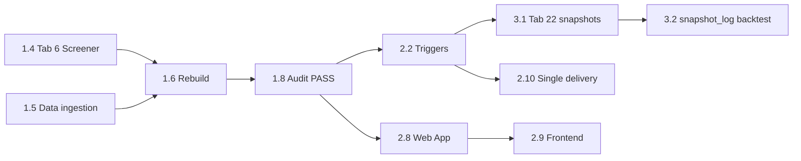

# Roadmap to 90/100 — Production Readiness

**Baseline:** [PRODUCTION_READINESS_REPORT.md](./PRODUCTION_READINESS_REPORT.md) — **67/100** (Beta), audit date 2026-06-04  
**Target:** **90/100** (Production Ready trajectory)  
**Gap to close:** **+23 points** on the component average  
**Reconciliation:** Static audit predates **Backtest Engine v3.0** (snapshot-only; synthetic cohorts removed), **DataIngestionEngine.gs**, **23-file** Apps Script tree, and **audit stage H_dataIngestion**. This roadmap reflects **current source** as of 2026-06-04.

---

## Executive summary

The Stock automation / Indian Equity Intelligence platform has **mature Apps Script logic** (scoring 2.1, six Tab 11 lists, DQ/alpha/risk, analyst notes, portfolio construction, 6/8 AM automation, morning brief API, Backtest v3, Next.js EquityIQ). The **67 score** reflects weak **live sheet population**, **undeployed triggers/credentials**, **dual delivery paths (n8n vs Apps Script)**, **recommendation fallback padding**, **insufficient Tab 22 history** (not synthetic backtest bias), **stale audit documentation (Tab 11b)**, and **no automated E2E validation**.

Closing **+23 points** requires a **sequenced mix**: (1) operational data + deploy, (2) automation and gate hardening, (3) 30+ days of backtest snapshots + audit extensions, (4) docs/tests/observability polish. Code-only fixes without a populated Sheet will not reach 90.

---

## Score model

Overall readiness is the **arithmetic mean** of ten component scores (each 0–100). Fixing a gap raises one or more components; **+pts** below is the estimated **contribution to the overall average** when that capability is fully done in production (live Sheet + deploy). Overlapping fixes are ordered so the **critical path** captures most points once; optional rows add marginal gains.

| # | Component | Baseline | At 90 (target) | Primary levers |
|---|-----------|--------:|---------------:|----------------|
| 1 | Code.gs (tabs, rebuild, menus) | 78 | 88 | SHEET_DEFS alignment, monolith maintainability |
| 2 | runSystemAudit.gs | 72 | 88 | Backtest/Web App/frontend stages, optional E2E |
| 3 | Scoring Engine | 68 | 85 | Tab 6 population, forensic CI, conviction distribution |
| 4 | Perplexity Pipeline | 62 | 78 | Retries, idempotency, cost policy |
| 5 | Recommendation Engine | 75 | 88 | No sub-gate fallback pad, empty-list policy |
| 6 | Automation (6/8 AM, brief) | 70 | 88 | Locks, weekday guard, credential fail policy |
| 7 | Triggers | 65 | 85 | Install + IST weekdays + market skip |
| 8 | n8n | 48 | 70 | Fix Parse JSON **or** retire path |
| 9 | Data Quality | 72 | 88 | Populated inputs + DQ alerting |
| 10 | Backtesting | 58 | 82 | Tab 22 history, v3 snapshot_log, audit stage |
| | **Average** | **67** | **90** | **+23** |

**Verdict at 90:** Live `runFullSystemAudit` → **PASS** (or documented PARTIAL with remediation date), Tab 6 ≥50 rows, avg DQ >40, Tab 22 ≥30 calendar days of daily snapshots, single morning delivery path, no critical doc/code drift on Tab 11 / rebuild / backtest.

---

## Reconciled baseline corrections

| PRODUCTION_READINESS_REPORT claim | Actual state (2026-06-04) |
|-----------------------------------|---------------------------|
| Backtest default `synthetic_cohort` | **Removed** — `BacktestEngine.gs` v3.0 uses `snapshot_log` or `insufficient_snapshots` only |
| 14 `.gs` files to paste | **23 engines** per `backend/automation/README.md` (incl. `DataIngestionEngine.gs`, `AnalystNoteEngine.gs`, etc.) |
| No auto-ingest tabs 4/6/24 | **Implemented** — menu **Data ingestion → Run ingestion now**; 6 AM step `data_ingestion` |
| Auto-ingest replaces Screener | **Partial** — NSE fills deals/shareholding/partial Tab 6; **weekly Screener CSV** still required for moat/valuation |
| runSystemAudit missing ingestion | **Present** — stage `H_dataIngestion` |
| Tab 23 header drift | **Mostly aligned** — `SHEET_DEFS` Tab 23 matches `BACKTEST_HEADERS_RESULTS`; legacy sheets may still need migration |

---

## Complete gap inventory

**Status:** `missing` = not in prod / not run · `partial` = code exists, live weak · `ops` = operator procedure, not missing code

### Data ingestion

| Capability | Rank | +pts | Status | Fix (brief) |
|------------|------|-----:|--------|-------------|
| Tab 6 fundamentals ≥50 rows (Screener-quality) | **H** | 4.0 | partial | **Data Ingestion v2** daily NSE batches + optional weekly Screener for moat; see `docs/DATA_INGESTION_V2.md` |
| Tab 4 bulk/block deals populated | **H** | 1.5 | partial | **Run data ingestion now** + **Backfill deals 30 days**; verify Tab 4 row count in audit |
| Tab 24 shareholding full-universe rotation | **M** | 1.0 | partial | Daily 6 AM batch (~35 symbols); ~15 trading days for 500 names — `docs/DATA_INGESTION.md` |
| NSE session/cookie failure alerting | **M** | 0.5 | missing | Surface `LAST_DATA_INGESTION_JSON` failures to Tab 12 / email when `ok:false` |
| BSE bulk fallback in Apps Script daily path | **L** | 0.5 | missing | Optional: wire `backend/backtest/ingest_market_data.py` cadence or document-only |
| Full moat/valuation without Screener | **M** | 1.0 | partial | Keep weekly Screener; optional `APPLY_PERPLEXITY_SCORES` policy (cost) |

### Scoring & conviction

| Capability | Rank | +pts | Status | Fix (brief) |
|------------|------|-----:|--------|-------------|
| Economically meaningful conviction (M>0 >>2%) | **H** | 3.0 | ops | Tab 6 + Tab 4 + rebuild; rerun **Scoring Engine 2.1 validation** |
| Forensic validation on golden sheet export | **M** | 1.5 | missing | CI or weekly: export `SCORING_ENGINE_VALIDATION_JSON` → `backend/scripts/generate_scoring_validation_md.py` |
| Conviction forensic in system audit (stale M) | **M** | 0.5 | partial | Post-rebuild `auditScoringConviction_`; ensure `reconcileConvictionColumn_` on deploy |
| Sector 100% Tab 1→19 join | **M** | 1.0 | partial | **Audit sector mapping** → **Repair sector mapping** |

### Perplexity & news

| Capability | Rank | +pts | Status | Fix (brief) |
|------------|------|-----:|--------|-------------|
| HTTP 429 backoff / retry | **M** | 1.5 | missing | Wrap `callPerplexityNewsExtraction_` in `Code.gs` with exponential backoff |
| Idempotent pipeline run keys | **M** | 1.0 | missing | Script property `LAST_NEWS_RUN_ID` + skip duplicate date/symbol set |
| Documented Perplexity cost guard | **M** | 1.0 | ops | `RUN_PERPLEXITY_DAILY=false` until Tab 7 validated |
| Structured morning JSON in n8n path | **M** | 1.0 | missing | Parse node in `workflow-indian-equity-morning.json` or disable n8n |

### Recommendations (Tab 11)

| Capability | Rank | +pts | Status | Fix (brief) |
|------------|------|-----:|--------|-------------|
| No fallback padding below quality gates | **H** | 2.0 | partial | `pickRecommendationCandidates_` L3783–3796 — only backfill symbols still passing `passesRecommendationQualityGate_` |
| Hard policy when list &lt;10 gate-passers | **M** | 1.0 | missing | Briefing section “insufficient picks”; optional skip Telegram list block |
| v2 false-positive filters enabled in prod | **M** | 0.5 | partial | `REC_FILTER_V2_ENABLED_` in `RecommendationAuditEngine.gs`; audit Tab **32** |
| Full Section 4 LLM recommendation cards | **L** | 1.0 | missing | Optional Perplexity cards; today `AnalystNoteEngine.gs` heuristic sections |
| Daily Tab 32 recommendation audit cadence | **L** | 0.5 | ops | Menu **Audit last 100 recommendations** after sync |

### Risk, portfolio, analyst, themes (engines)

| Capability | Rank | +pts | Status | Fix (brief) |
|------------|------|-----:|--------|-------------|
| Risk engine on every rebuild (`applyRiskEngineBatch_`) | **M** | 0.5 | partial | Deploy `RiskEngine.gs`; verify Tab 29 |
| Portfolio Tab 30 + `?action=portfolio` in prod | **M** | 0.5 | partial | **Build portfolio models**; frontend `/portfolio` |
| Analyst note completeness enforced | **M** | 0.5 | partial | `finalizeRecommendationPicksWithAnalystNotes_` — verify skip/backfill in live Tab 11 |
| Theme intelligence API + UX | **L** | 0.5 | partial | `ThemeIntelligenceEngine.gs`; Web App `?action=theme_intelligence` |
| Conviction Engine 3.0 in audit | **M** | 0.5 | missing | Add audit sample using `ConvictionEngine3.gs` outputs |

### Backtest (v3)

| Capability | Rank | +pts | Status | Fix (brief) |
|------------|------|-----:|--------|-------------|
| ≥30 days Tab 22 snapshots per list (≥5 rows/list) | **H** | 3.0 | ops | 8 AM `snapshotAllBacktestLists_`; wait for `snapshot_log` mode |
| Backtest health in system audit | **M** | 1.0 | missing | Stage: Tab 22 counts, `LAST_BACKTEST_JSON`, mode ≠ `insufficient_snapshots` |
| Trust hit-rate / alpha claims (CI) | **M** | 1.0 | missing | Export Tab 23 + assert thresholds in fixture test |
| Legacy Tab 22 `synthetic` rows excluded | **L** | 0.0 | partial | v3 filters `source` containing `synthetic` — purge old rows |
| Offline `run_backtest.py` vs Sheet truth | **L** | 0.5 | partial | Document as research-only; Sheet is canonical |

### Automation & triggers

| Capability | Rank | +pts | Status | Fix (brief) |
|------------|------|-----:|--------|-------------|
| All 23 `.gs` pasted + authorized | **H** | 2.0 | ops | `backend/automation/README.md` file list |
| Triggers installed (6 AM + 8 AM IST) | **H** | 1.5 | ops | **Install triggers — 6 AM + 8 AM IST** |
| Weekday-only triggers (no weekend rebuild) | **M** | 1.5 | missing | `everyWeekdays()` or `isNseTradingDay_()` guard in `DailyAutomation.gs` |
| Overlap lock (6 AM vs manual rebuild) | **M** | 1.0 | missing | Script lock property `PIPELINE_LOCK` with TTL |
| Credential missing → visible FAIL (not silent skip) | **M** | 0.5 | partial | 8 AM summary flags MISSING channels |
| Market holiday calendar skip | **L** | 0.5 | missing | NSE holiday list or skip Sat/Sun + known holidays |

### n8n (optional path)

| Capability | Rank | +pts | Status | Fix (brief) |
|------------|------|-----:|--------|-------------|
| Parse Report structured JSON (TODO) | **M** | 1.5 | missing | Fix `workflow-indian-equity-morning.json` Parse node |
| Single canonical delivery path | **M** | 1.0 | ops | Apps Script 8 AM **or** n8n — `docs/PHASE6_AUTOMATION.md` |
| n8n does not write Tabs 15–20 | **L** | 0.0 | partial | By design; document |
| Production n8n deployment evidence | **L** | 0.5 | missing | Hosting + credentials `CONFIGURE_GOOGLE_SHEETS` |

### System audit & validation

| Capability | Rank | +pts | Status | Fix (brief) |
|------------|------|-----:|--------|-------------|
| Live audit PASS with Tab 6 ≥50, avg DQ >40 | **H** | 2.0 | ops | **Run full system audit** after data + rebuild |
| Optional E2E rebuild in audit | **M** | 1.5 | missing | Flag `runPipelineDryRun` (time-boxed) in `runSystemAudit.gs` |
| Web App deployment check | **M** | 1.0 | missing | HEAD `?action=health` on deployed URL from Script property |
| Frontend connectivity probe | **M** | 0.5 | missing | Document curl/`frontend` build against Web App URL |
| Simulate Tab 11 picks validates narratives | **M** | 0.5 | partial | Extend `auditRecommendationLists_` for analyst note completeness |

### API, frontend, deploy

| Capability | Rank | +pts | Status | Fix (brief) |
|------------|------|-----:|--------|-------------|
| Web App deployed (Execute as Me, Anyone) | **H** | 1.5 | ops | `WebAppApi.gs` → **Show EquityIQ Web App URL** |
| `NEXT_PUBLIC_SHEETS_API_URL` in `frontend/.env.local` | **H** | 1.0 | ops | Settings page test connection |
| Root README lists all 23 `.gs` files | **M** | 0.5 | missing | Update `README.md` quick start (still shows 3 files) |
| `docs/USER_SETUP.md` path `apps-script/Code.gs` | **L** | 0.5 | missing | Point to `backend/automation/` |
| All Web App actions documented in UI | **L** | 0.5 | partial | health, top10, symbol, macro, backtest, morning_brief, portfolio, theme_intelligence |

### Testing

| Capability | Rank | +pts | Status | Fix (brief) |
|------------|------|-----:|--------|-------------|
| Fixture sheet automated E2E | **H** | 2.0 | missing | Copy template Sheet; scripted audit + API assertions |
| Apps Script unit tests (clasp + jest) | **M** | 1.0 | missing | Extract pure functions or golden JSON tests |
| `FINAL_ACCEPTANCE_TEST.md` automated | **M** | 1.0 | partial | curl health/top10 + `npm run build` in CI |

### Security & compliance

| Capability | Rank | +pts | Status | Fix (brief) |
|------------|------|-----:|--------|-------------|
| Web App auth token (not open Anyone) | **M** | 1.0 | missing | Shared secret query param or Google OAuth proxy |
| Multi-user / role-based frontend | **L** | 0.5 | missing | Out of scope for single-operator; document |
| Secrets only in Script Properties | **M** | 0.5 | ops | Never commit `.env` with keys |
| Immutable audit trail | **L** | 0.5 | missing | Append-only AUDIT SNAPSHOT policy |

### Observability

| Capability | Rank | +pts | Status | Fix (brief) |
|------------|------|-----:|--------|-------------|
| Alert when avg DQ &lt; 40 | **M** | 1.0 | missing | `auditStageDataQuality_` → Tab 12 + optional email |
| External uptime on Web App | **M** | 0.5 | missing | Cron ping `?action=health` |
| Operator dashboard for `LAST_*_JSON` | **L** | 0.5 | partial | Frontend settings or Sheet tab |

### Documentation drift

| Capability | Rank | +pts | Status | Fix (brief) |
|------------|------|-----:|--------|-------------|
| `FULL_SYSTEM_AUDIT.md` Tab 11b / `refreshDashboardViews` | **M** | 1.0 | missing | Rewrite to Tab 11 only, 24-tab schema |
| `AUTOMATION_PIPELINE.md` Stage 4 → 11b | **M** | 0.5 | missing | 10→11 only |
| `E2E_LIVE_FUNCTIONALITY_AUDIT.md` 11b stages | **M** | 0.5 | missing | Align with `runSystemAudit.gs` |
| `EVENT_LED_ARCHITECTURE.md` / `13-dashboard-views.md` | **L** | 0.5 | missing | Mark 11b deprecated |
| `PRODUCTION_READINESS_REPORT.md` synthetic backtest | **L** | 0.0 | missing | Amend §10 after live re-audit |
| `CURRENT_STATE_REPORT.md` refresh | **L** | 0.5 | missing | Post-90 snapshot |

### Sheet / tab stubs

| Capability | Rank | +pts | Status | Fix (brief) |
|------------|------|-----:|--------|-------------|
| Tab 21 `syncAnalysisOutput` no-op | **L** | 0.0 | partial | Document evidence on Tab 11 `evidence` column |
| Tab 11b removed from `setupAllSheets` | **L** | 0.0 | partial | Delete legacy sheet if present — `docs/SHEET_SETUP.md` |
| PRICE_REFRESH_MAX_SYMBOLS = 100 | **M** | 0.5 | partial | Raise or rotate cursor for large universe |
| NSE CSV import 403 risk | **M** | 0.5 | partial | Session + manual CSV fallback |

**Point budget note:** Individual **+pts** sum to **~42** if every row were fixed independently. The **critical path** below delivers **+23** without double-counting overlapping data/deploy wins.

---

## Phased implementation sequence

### Phase 1 — Deploy & data foundation (target **~74**, +7 cumulative)

| Seq | Task | File / menu touchpoints | Acceptance criteria |
|-----|------|-------------------------|---------------------|
| 1.1 | Paste **all** `backend/automation/*.gs` (23 files) | Apps Script project; `README.md` | No `ENGINE_NOT_LOADED` in rebuild; audit functions list PASS |
| 1.2 | **Setup all sheet tabs** | Menu: Stock Tracker → Setup all sheet tabs | `SHEET_DEFS` tabs 1–24 + 29–32 present |
| 1.3 | Import UNIVERSE | **Import full NSE universe (EQ)** or sample | Tab 1 ≥100 rows |
| 1.4 | Weekly Screener → Tab 6 | **Import Screener CSV to Tab 6**; `docs/USER_SETUP.md` | Tab 6 ≥50 rows; audit `B_fundamentals` not PARTIAL |
| 1.5 | Run NSE ingestion | **Data ingestion → Run ingestion now**; **Backfill deals 30 days** | Tab 4 &gt;0; `H_dataIngestion` not FAIL |
| 1.6 | Rebuild pipeline | **Rebuild scoring pipeline from UNIVERSE** | Tab 10 populated; Tab 11 six lists written |
| 1.7 | Scoring validation | **Run Scoring Engine 2.1 validation** | `SCORING_ENGINE_VALIDATION_JSON`; M&gt;0 share materially above 2% |
| 1.8 | Full system audit | **Run full system audit** | Overall PASS or PARTIAL only on backtest/triggers |

**Cumulative score:** ~**74/100**

---

### Phase 2 — Automation, gates & delivery (target **~82**, +15 cumulative)

| Seq | Task | File / menu touchpoints | Acceptance criteria |
|-----|------|-------------------------|---------------------|
| 2.1 | Script properties | Apps Script → Project settings | `TELEGRAM_*`, `BRIEFING_EMAIL_TO`; `RUN_PERPLEXITY_DAILY=false` until ready |
| 2.2 | Install triggers | **Install triggers — 6 AM + 8 AM IST** | `auditStageTriggers_` PASS (both handlers) |
| 2.3 | Test runs | **Run 6 AM refresh now**; **Run 8 AM briefing now** | `LAST_AUTOMATION_RUN_JSON`, `LAST_MORNING_BRIEFING_JSON` ok |
| 2.4 | Weekday guard | `DailyAutomation.gs` `installDailyAutomationTriggers` | No Saturday/Sunday full rebuild (or trading-day check) |
| 2.5 | Pipeline lock | `Code.gs` / `DailyAutomation.gs` | Concurrent manual rebuild + 6 AM does not corrupt Tab 10 |
| 2.6 | Tighten recommendation fallback | `Code.gs` `pickRecommendationCandidates_` | No symbol on Tab 11 that fails `passesRecommendationQualityGate_` |
| 2.7 | Briefing empty-list policy | `MorningBriefEngine.gs` / `DailyAutomation.gs` | Lists with &lt;3 picks show explicit “insufficient quality” |
| 2.8 | Deploy Web App | Deploy → Web app; `WebAppApi.gs` | `?action=health` → `ok:true` |
| 2.9 | Frontend URL | `frontend/.env.local`, **Settings** | Dashboard + **Recommendations** load live lists |
| 2.10 | Single delivery path | `docs/PHASE6_AUTOMATION.md`; disable n8n cron **or** fix Parse JSON | One morning brief source documented |
| 2.11 | Perplexity retries | `Code.gs` news pipeline | Simulated 429 does not abort entire 6 AM run |
| 2.12 | DQ alerting | `runSystemAudit.gs` or `DataQualityEngine.gs` | Tab 12 alert when universe avg DQ &lt;40 |

**Cumulative score:** ~**82/100**

---

### Phase 3 — Backtest history & audit depth (target **~87**, +20 cumulative)

| Seq | Task | File / menu touchpoints | Acceptance criteria |
|-----|------|-------------------------|---------------------|
| 3.1 | Daily Tab 22 snapshots | 8 AM `snapshotAllBacktestLists_`; menu **Snapshot all lists → Tab 22** | Tab 22 grows daily; six `list_name` values |
| 3.2 | Wait for v3 mode | `BacktestEngine.gs`; **Run backtest engine** | Tab 23 `mode=snapshot_log` for ≥4 lists |
| 3.3 | Backtest audit stage | `runSystemAudit.gs` | Stage reports snapshot counts + `insufficient_snapshots` lists |
| 3.4 | Web App audit stage | `runSystemAudit.gs` | Stores health check result in `LAST_SYSTEM_AUDIT_JSON` |
| 3.5 | Frontend `/backtest` | `frontend/src/app/backtest/` | Charts show non-empty horizons when Tab 23 populated |
| 3.6 | Recommendation audit | **Audit last 100 recommendations** | Tab **32**; v2_pass rate documented |
| 3.7 | Fixture E2E (minimal) | New `backend/scripts/` or CI workflow | Template Sheet: audit PASS + top10 six fields |
| 3.8 | Doc cleanup 11b | `FULL_SYSTEM_AUDIT.md`, `AUTOMATION_PIPELINE.md`, `E2E_LIVE_*.md` | No rebuild step referencing 11b |

**Cumulative score:** ~**87/100**

---

### Phase 4 — Production polish (target **~90**, +23 cumulative)

| Seq | Task | File / menu touchpoints | Acceptance criteria |
|-----|------|-------------------------|---------------------|
| 4.1 | 30+ days Tab 22 history | Operational calendar | Backtest component ≥80; hit rates interpretable |
| 4.2 | Forensic CI / weekly export | `ScoringEngineValidation.gs`, `docs/SCORING_ENGINE_VALIDATION.md` | §B filled from live JSON |
| 4.3 | n8n Parse JSON **or** retire | `workflow-indian-equity-morning.json` | No `TODO: parse structured JSON` in prod path |
| 4.4 | Web App token auth | `WebAppApi.gs` | Unknown token → 401; frontend sends token |
| 4.5 | Uptime ping | External cron | Alert if health fails 2× |
| 4.6 | Update root README | `README.md` | Lists 23 files, data ingestion, audit, backtest v3 |
| 4.7 | Re-score readiness | `PRODUCTION_READINESS_REPORT.md` | Regenerated static audit ≥90 average |

**Cumulative score:** ~**90/100**

---

## Dependencies & critical path

**Blocking:** Tab 6 + Tab 4/24 → meaningful Tab 10/11 → audit PASS → triggers → 30d Tab 22 → backtest trust.  
**Parallel:** Doc cleanup (Phase 3.8), Perplexity retries (2.11), frontend (2.9) after Web App (2.8).

---

## Quick wins vs structural work

| Quick wins (days) | Structural (weeks) |
|-------------------|---------------------|
| Paste 23 `.gs`, run setup + rebuild | 30-day Tab 22 snapshot accumulation |
| Install triggers; set `RUN_PERPLEXITY_DAILY=false` | Fixture Sheet E2E + CI |
| Import one Screener CSV band | Forensic validation in CI |
| Deploy Web App + frontend URL | Web App token auth |
| Set `RUN_PERPLEXITY_DAILY=false` | Weekday + holiday calendar |
| Run audit; fix Telegram props | Remove fallback padding (code + validate list counts) |
| Disable n8n if using Apps Script 8 AM | Perplexity idempotency + retry |
| Update README quick start | n8n structured JSON (if keeping n8n) |

---

## Definition of done at 90/100

| Gate | Evidence |
|------|----------|
| **Data** | Tab 6 ≥50 rows; Tab 4 deals present; avg Tab 10 DQ &gt;40; conviction M&gt;0 well above 2% of universe |
| **Automation** | 6 AM + 8 AM triggers installed; weekday guard; 14 consecutive trading-day Tab 22 snapshots |
| **Recommendations** | Six Tab 11 lists; no gate-failing fallback rows; analyst notes complete on sampled picks |
| **Backtest** | Tab 23 `mode=snapshot_log` for tracked lists; v3 notes free of synthetic reliance |
| **API/UX** | Web App health OK; EquityIQ Settings connected; `/`, `/recommendations`, `/backtest`, `/brief` functional |
| **Audit** | `runFullSystemAudit` → **PASS**; `LAST_SYSTEM_AUDIT_JSON` archived; backtest + Web App stages PASS |
| **Delivery** | Single path: Apps Script institutional brief per `MORNING_BRIEF_TEMPLATE.md` **or** n8n with structured JSON |
| **Docs** | No Tab 11b in active audit path; `ROADMAP_TO_90.md` items Phase 1–4 checked |
| **Ops** | `OPERATING_CADENCE.md` weekly Screener + monthly validation; alerts on DQ/backtest/ingestion failure |

---

## Reference — Apps Script menu map (operator)

| Area | Stock Tracker menu items |
|------|--------------------------|
| Setup | Setup all sheet tabs · Rebuild scoring pipeline · Import NSE / Screener |
| Data | Data ingestion → Run ingestion now · Backfill deals 30 days |
| Scoring | Run Scoring Engine 2.1 validation · Preview DQ / alpha / risk |
| Tab 11 | Sync recommendations · Audit Tab 11 · Audit last 100 |
| Backtest | Snapshot all lists → Tab 22 · Run backtest engine |
| Automation | Install triggers 6+8 AM · Run 6 AM / 8 AM now · Preview morning brief JSON |
| Audit | Run full system audit · Show EquityIQ Web App URL |

---

## Reference — Sheet tabs (high impact)

| Tab | Name | Role |
|-----|------|------|
| 1 | UNIVERSE | Eligibility filter source |
| 4 | BULK & LARGE DEALS | Institutional J / DQ |
| 6 | FUNDAMENTALS | Pillars C–F, data gate |
| 10 | SCORING MODEL | Conviction 2.1 |
| 11 | RANKED WATCHLIST | Six Top-10 lists |
| 22 | BACKTEST LOG | Daily snapshots (v3) |
| 23 | BACKTEST RESULTS | Hit rate / alpha |
| 24 | SHAREHOLDING PATTERN | FII/DII deltas |
| 29 | RISK BREAKDOWN | Risk engine |
| 30 | PORTFOLIO MODELS | Portfolio construction |
| 32 | RECOMMENDATION AUDIT | v2 filter audit |

---

*Next step after Phase 4.7: regenerate [PRODUCTION_READINESS_REPORT.md](./PRODUCTION_READINESS_REPORT.md) from live Sheet execution and update component table to ≥90.*
